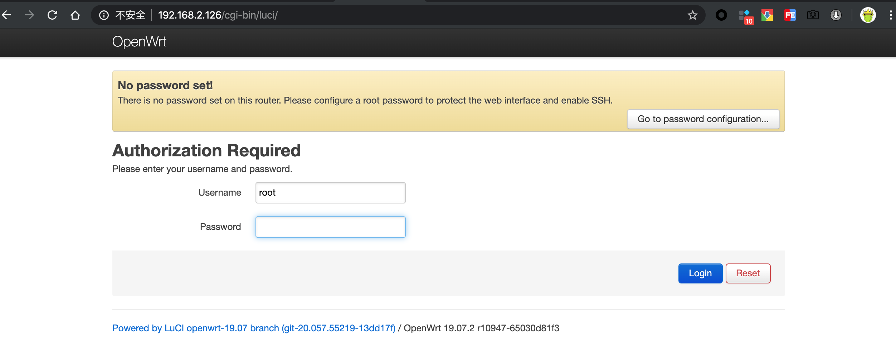
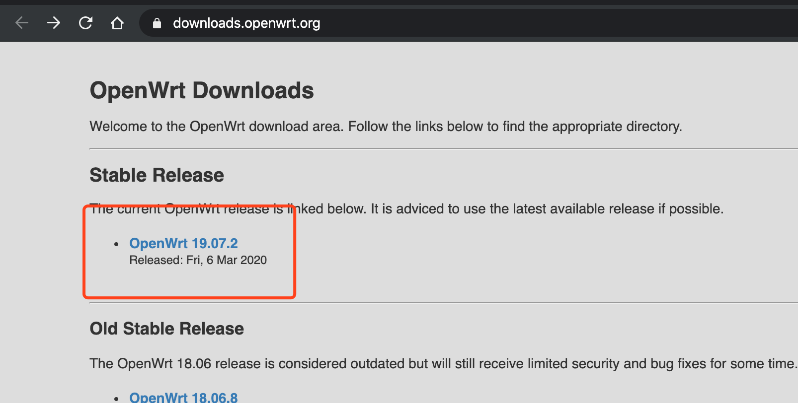
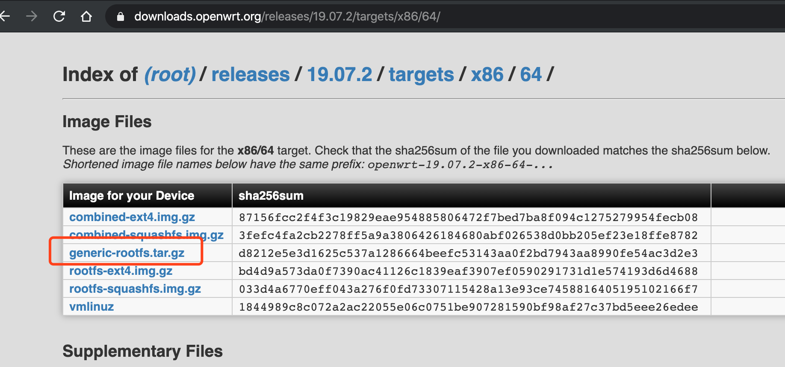
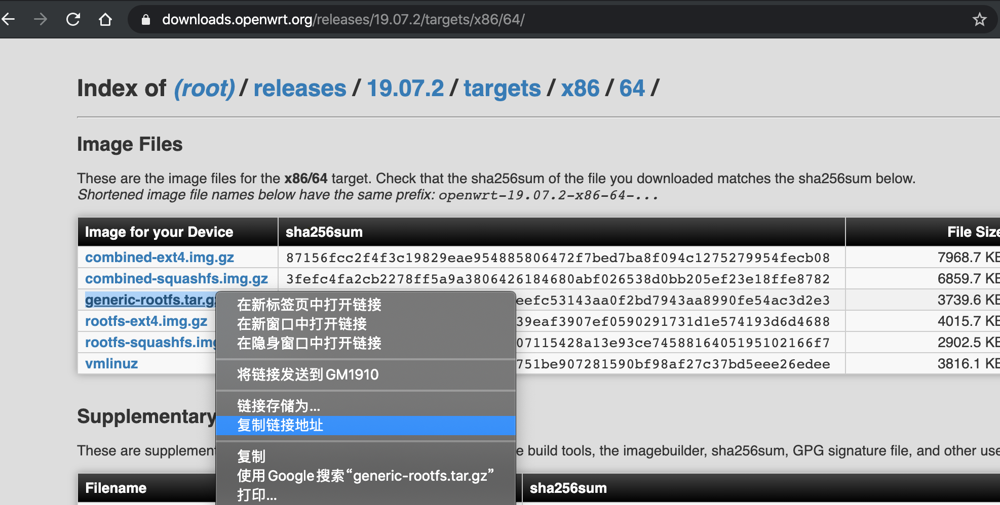

[toc]

# OpenWrt Docker镜像构建

为了在Docker中运行OpenWrt系统，我们需要用到OpenWrt的docker镜像,网上有很多人分享已经制作好的镜像。但是，每个人都有自己不同的需求，自己学会制作镜像就显得特别重要了。


其实使用OpenWrt的固件, 可以很方便的构建Docker镜像，这里的固件不光是官方固件，也可以是经过自己定制编译生成的固件。

## 直接使用

如果你只想下载并使用，不关心构建流程，那么你可以直接用下面的命令，并参考后面镜像使用配置部分了解如何使用镜像

```bash
# 下载镜像
$ docker pull crazygit/openwrt-x86-64

# 查看镜像信息
$ docker run --rm crazygit/openwrt-x86-64 cat /etc/banner
  _______                     ________        __
 |       |.-----.-----.-----.|  |  |  |.----.|  |_
 |   -   ||  _  |  -__|     ||  |  |  ||   _||   _|
 |_______||   __|_____|__|__||________||__|  |____|
          |__| W I R E L E S S   F R E E D O M
 -----------------------------------------------------
 OpenWrt 19.07.2, r10947-65030d81f3
 -----------------------------------------------------
```

如果觉得官网镜像功能太简单，也可以用我编译的Lean'S大神的OpenWrt固件

<https://github.com/crazygit/Actions-OpenWrt>

## 镜像使用配置

镜像的使用可以参考下面两篇文章的方式进行配置,两位都做了非常详细的描述。

* [在Docker 中运行 OpenWrt 旁路网关](https://mlapp.cn/376.html)
* [Docker上运行Lean大源码编译的OpenWRT](https://openwrt.club/93.html)

同样，如果觉得手动配置比较麻烦，可以使用我整理好使用`docker-compose`的一键拉起服务文件

<https://github.com/crazygit/family-media-center>

这里主要描述下本人的手动配置方式

首先说说我的使用场景:

我是在宿主机上通过`Docker`运行`OpenWrt`系统，使用它作为旁路由

* 宿主机操作系统: `Ubuntu 18.04.4 LTS`
* 宿主机IP: `192.168.2.125`
* 硬路由IP: `192.168.2.1`
* 分配给OpenWrt系统的IP: `192.168.2.126`

1. 获取网卡名称, 我的网卡名称是`enp3s0`
    ```bash
    $ ifconfig
    br-df8369127cee: flags=4099<UP,BROADCAST,MULTICAST>  mtu 1500
            inet 172.21.0.1  netmask 255.255.0.0  broadcast 172.21.255.255
            ether 02:42:12:cd:c6:2c  txqueuelen 0  (Ethernet)
            RX packets 0  bytes 0 (0.0 B)
            RX errors 0  dropped 0  overruns 0  frame 0
            TX packets 0  bytes 0 (0.0 B)
            TX errors 0  dropped 0 overruns 0  carrier 0  collisions 0

    docker0: flags=4099<UP,BROADCAST,MULTICAST>  mtu 1500
            inet 172.17.0.1  netmask 255.255.0.0  broadcast 172.17.255.255
            ether 02:42:18:57:96:e1  txqueuelen 0  (Ethernet)
            RX packets 0  bytes 0 (0.0 B)
            RX errors 0  dropped 0  overruns 0  frame 0
            TX packets 0  bytes 0 (0.0 B)
            TX errors 0  dropped 0 overruns 0  carrier 0  collisions 0

    enp3s0: flags=4163<UP,BROADCAST,RUNNING,MULTICAST>  mtu 1500
            inet 192.168.2.125  netmask 255.255.255.0  broadcast 192.168.2.255
            inet6 fe80::2e56:dcff:fe3c:548a  prefixlen 64  scopeid 0x20<link>
            ether 2c:56:dc:3c:54:8a  txqueuelen 1000  (Ethernet)
            RX packets 2099  bytes 2435262 (2.4 MB)
            RX errors 0  dropped 0  overruns 0  frame 0
            TX packets 1149  bytes 104504 (104.5 KB)
            TX errors 0  dropped 0 overruns 0  carrier 0  collisions 0

    lo: flags=73<UP,LOOPBACK,RUNNING>  mtu 65536
            inet 127.0.0.1  netmask 255.0.0.0
            inet6 ::1  prefixlen 128  scopeid 0x10<host>
            loop  txqueuelen 1000  (Local Loopback)
            RX packets 110  bytes 9098 (9.0 KB)
            RX errors 0  dropped 0  overruns 0  frame 0
            TX packets 110  bytes 9098 (9.0 KB)
            TX errors 0  dropped 0 overruns 0  carrier 0  collisions 0
    ```

2. 开启宿主机网卡混杂模式(可选)

    ```bash
    # 网卡名称enp3s0用你自己上一步获取到的
    $ sudo ip link set enp3s0 promisc on
    ```

3. 为`docker`创建`macvlan`模式的虚拟网络

    子网`--subnet`和网关`--gateway`，以及`parent=enp3s0`网卡名称根据实际情况做调整

    ```bash
    $ docker network create -d macvlan --subnet=192.168.2.0/24 --gateway=192.168.2.1 -o parent=enp3s0 openwrt-LAN

    # 查看创建的虚拟网络
    $ docker network ls |grep openwrt-LAN
    21dcddacc389        openwrt-LAN         macvlan             local
    ```

4. 启动容器

    ```bash
    # --network使用第4步创建的虚拟网络
    $ docker run --restart always --name openwrt -d --network openwrt-LAN --privileged crazygit/openwrt-x86-64

    # 查看启动的容器
    $ docker ps -a
    ```

5. 进入容器，修改网络配置文件并重启网络

    进入容器并修改`etc/config/network`文件

    ```bash
    $ docker exec -it openwrt /bin/sh
    $ vi /etc/config/network
    ```
    编辑`lan`口的配置如下，有些参数默认的文件里可能没有，按照下面的格式添加上即可
    ```
    config interface 'lan'
            option type 'bridge'
            option ifname 'eth0'
            option proto 'static'
            option ipaddr '192.168.2.126'
            option netmask '255.255.255.0'
            option gateway '192.168.2.1'
            option dns '192.168.2.1'
            option broadcast '192.168.2.255'
            option ip6assign '60'
    ```
    上面的参数根据自身的情况调整
    * `proto`设置使用静态分配IP地址的方式`static`
    * `ipaddr`为OpenWrt系统分配的静态IP，这里我分配的是`192.168.2.126`(注意: 这个IP地址不要与你本地网络已有的IP地址冲突)
    * `netmask`为子网掩码`255.255.255.0`
    * `gateway`为路由器(硬路由)的网关，通常就是你访问路由器的IP地址，这里我是`192.168.2.1`
    * `dns`为`DNS`服务器的地址，可以是运营商的地址，比如`114.114.114.114`,这里我直接用的路由器的地址`192.168.2.1`
    * `broadcast`为广播地址`192.168.2.255`

    重启网络

    ```bash
    $ /etc/init.d/network restart
    ```
6. 宿主机网络修复(**目前不生效**)

   如上配置后，通过宿主机没法直接访问OpenWrt系统的网络，参考
    [将OpenWRT作为宿主机的网关
](https://openwrt.club/93.html#scroll-6)

    里的方法，使用如下脚本修复网络，**但是不生效**(希望知道的大神不吝赐教)。不过使用局域网的其他设备可以正常访问OpenWrt系统

    ```bash
    #根据实际情况修改下面两个变量
    # 网卡名称
    card="enp3s0"
    # OpenWrt系统的IP地址
    openwrt_gateway="192.168.2.126"

    sudo ip link add link $card vLAN type macvlan mode bridge
    sudo ip addr add 192.168.2.253/24 brd + dev vLAN
    sudo ip link set vLAN up
    sudo ip route del default
    sudo ip route add default via $openwrt_gateway dev vLAN

    #设置宿主机的dns服务器为OpenWRT
    echo "nameserver $openwrt_gateway" |sudo tee /etc/resolv.conf
    ```

7. 验收成果

    如第7步所介绍的，我们暂时没有办法直接从宿主机访问OpenWrt，只有借助局域网其他设备上的浏览器，打开OpenWrt系统

    <http://192.168.2.126>

    我使用的是官方固件，初始密码默认为空,其他固件的初始密码视具体的固件而定了

    

    剩下的就是openWrt系统的常规使用和配置，这里就不再详述了

## 手动构建

如果你对自己构建感兴趣，可以继续看下去

### 使用官方固件

这里以`x86-64`平台为例

首先获取获取固件的下载地址

1. 打开[官网](https://downloads.openwrt.org/)，选择当前最新的稳定版本`19.07.2`

2. 选择`x86`平台

3. 选择`64`位

4. 选择固件`generic-rootfs.tar.gz`

5. 鼠标右键点击"复制链接地址"获取到固件的下载地址，第6步会用到

6. 构建镜像

    ```bash
    $ git clone https://github.com/crazygit/openwrt-x86-64.git openwrt-x86-64
    $ cd openwrt-x86-64
    # 参数1: 第5步中获取的固件下载地址
    # 参数2: docker镜像的名字，可以随便指定: 如crazygit/openwrt-x86-64
    $ ./build.sh "https://downloads.openwrt.org/releases/19.07.2/targets/x86/64/openwrt-19.07.2-x86-64-generic-rootfs.tar.gz" crazygit/openwrt-x86-64
    ```

### 构建自己的镜像

1. 编译自己的固件,可以参考：

    https://github.com/crazygit/Actions-OpenWrt

2. 下载本库

    ```bash
    $ git clone https://github.com/crazygit/openwrt-x86-64.git openwrt-x86-64
    ```
3. 拷贝自己的固件到`Dockerfile`文件所在的目录,固件文件名后缀应该是`.tar.gz`的

    ```bash
    $ cd openwrt-x86-64
    $ cp /path/to/your/firmware.tar.gz openwrt.tar.gz
    ```

4. 编译镜像

    ```bash
    # -t后面为镜像的名字，可以随便指定: 如: crazygit/openwrt-x86-64
    $ docker build . --build-arg FIRMWARE=openwrt.tar.gz -t crazygit/openwrt-x86-64
    ```

## 使用Github Action自动构建

1. Fork当前仓库
2. 在项目`Settings->Secrets`里配置你的docker hub账户的用户名和密码`DOCKER_USERNAME`和`DOCKER_TOKEN`
3. 在docker hub上创建你在一个仓库来存放编译的镜像
4. 根据自己的情况修改`.github/workflows/build.yml`文件中的如下环境变量

    ```yaml
    env:
      FIRMWARE_URL: "https://downloads.openwrt.org/releases/19.07.2/targets/x86/64/openwrt-19.07.2-x86-64-generic-rootfs.tar.gz"
      REPOSITORY: crazygit/openwrt-x86-64
      TAG: 19.07.2
    ```
5. 提交修改之后，github action会自动编译镜像并将镜像push到你的docker hub账户中指定的仓库里

### 验证镜像

下面的命令注意替换镜像名字`crazygit/openwrt-x86-64`为你自己编译时使用的名字

1. 查看编译的镜像

    ```
    $ docker image ls |grep crazygit/openwrt-x86-64
    crazygit/openwrt-x86-64                                                          latest              07f578cefd53        12 minutes ago      9.43MB
    ```

2. 验证镜像是否正常

    ```bash
    $ docker run --rm crazygit/openwrt-x86-64 cat /etc/banner
    _______                     ________        __
    |       |.-----.-----.-----.|  |  |  |.----.|  |_
    |   -   ||  _  |  -__|     ||  |  |  ||   _||   _|
    |_______||   __|_____|__|__||________||__|  |____|
            |__| W I R E L E S S   F R E E D O M
    -----------------------------------------------------
    OpenWrt 19.07.2, r10947-65030d81f3
    -----------------------------------------------------
    ```

## 参考

本文构建过程参考自:

<https://openwrt.org/docs/guide-user/virtualization/docker_openwrt_image>

备注: 官网中的`Dockerfile`示例有一处错误是

```
ADD https://downloads.openwrt.org/chaos_calmer/15.05/x86/generic/openwrt-15.05-x86-generic-Generic-rootfs.tar.gz /
```
上面的语句是无效的，因为`ADD`指令只有在添加本地的`.tar.gz`文件时才会自动解压，添加`URL`时不会自动解压。建议使用本仓库的构建方式。
